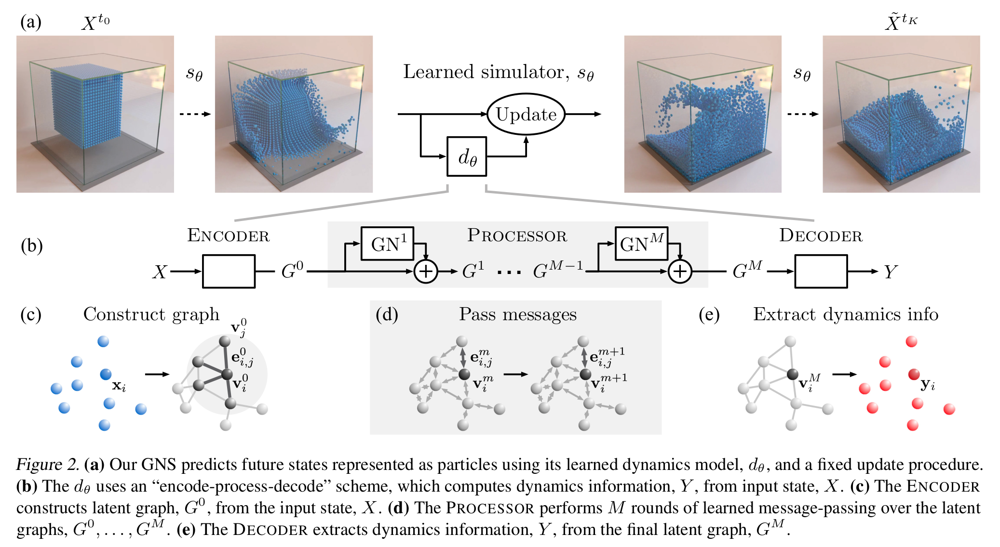

## Learning to Simulate Complex Physics with Graph Networks

> Sanchez-Gonzalez, A., Godwin, J., Pfaff, T., Ying, R., Leskovec, J., & Battaglia, P. (2020, November). Learning to simulate complex physics with graph networks. In _International Conference on Machine Learning_ (pp. 8459-8468). PMLR.

[Paper](https://arxiv.org/pdf/2002.09405.pdf)

[Code](https://github.com/deepmind/deepmind-research/tree/master/learning_to_simulate)

> Keywords: #graph-neural-networks #simulation

### Research questions

- How to tackle scaling up behavior on large systems?
> Each graph node could potentially represent a larger number of particles.

- How are inductive biases of the system introduced?
> Certain global properties and constraints are applied to the nodes of the graph. 

- How are material properties and states represented?
> Could be both global graph-level properties (such as gravity) or local node-level properties such as velocities

- How to account for short-range interactions?
> Using connection radius as a hyperparameter, the interaction range is described by the connectivity between nodes in a graph.
    
### Future research / unanswered questions

- What state-spaces should be considered in the modeling?
- How do we incorporate complex dynamics using a learning approach or message-passing interface
- How to include long-range interactions?
- How does one minimize errors over long simulation trajectories?

### Main findings
- Graph Networks (GNs) map an input graph to an output graph with the same network, but different node, edge, and graph-level attributes can be trained to learn a form of message passing. 

- Euler integration is used to get $\tilde{X}^{t_{k+1}} = Update (\tilde{X}^{t_k}, d_\theta)$. The $d_\theta$ is the learning parameter. It is important learn different values of $\theta$ that allows $\theta$ to span a wide range of particle-particle interaction forces. 
- Particle-based simulations are used to construct a message passing on a graph. Nodes represent particles or a collection of particles. Edges represent the pairwise relationships among particles.
- A learnable simulator $s_\theta$ computes the dynamics information with a parameterized function approximator $d_\theta: \mathcal{X}\rightarrow \mathcal{Y}$, whose parameters $\theta$ are optimized using some training objective. 
- $d_\theta$ has three stages: Encoder - Processor - Decoder
	- **Encoder**: $\mathcal{X}\rightarrow\mathcal{G}$ embeds particle state representation $X$ as a latent graph. Directed edges represent potential interactions between particles. Global properties such as gravity are applied at input nodes. 
	- **Processor**: $\mathcal{G}\rightarrow\mathcal{G}$ computes interaction among nodes via $M$ steps of learned message passing. The number of message passing steps required will likely scale with the complexity of interactions. 
	- **Decoder**: $\mathcal{G} \rightarrow \mathcal{Y}$ extracts dynamic information from nodes of graph as $y_i = \delta^v (v_i^M)$. Learning $\delta_v$ should consider the $\mathcal{Y}$ representation to reflect relevant dynamics information, such as acceleration. 
- $C = 5$, five previous step velocities were chosen as an input to each node, and $C$ is a hyperparameter. 
- Multi-Layer Perceptron (MLP) has two hidden layers (with ReLU activation). All except the output layer are followed by *LayerNorm* (to improve stability). 
- Added training noise and use normalization values on training. Although normalization improved the convergence speed in training, the performance did not improve. 
- $L^2$ loss is computed as per-particle acceleration.
- Mean Square Error is used to compute the error. Training takes up to a week for 20k particles. 
- Two hyperparameters, _number of message passing_ and _connectivity radius_, affect the output of GNS. 