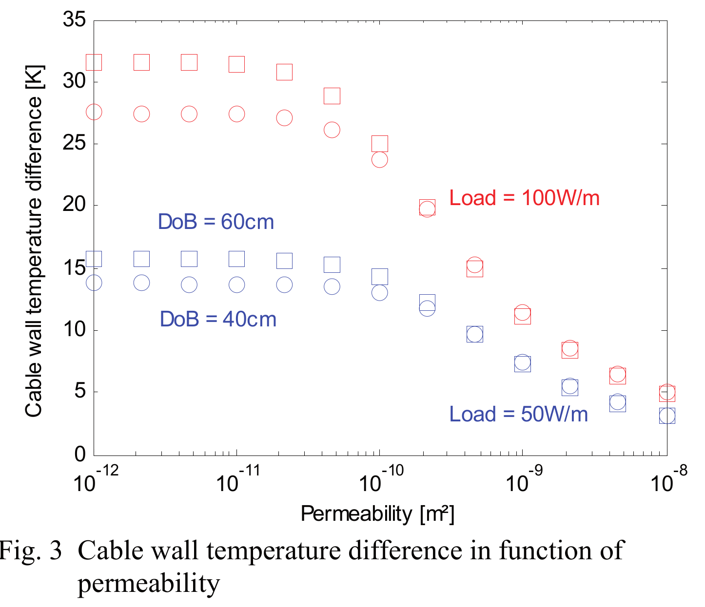
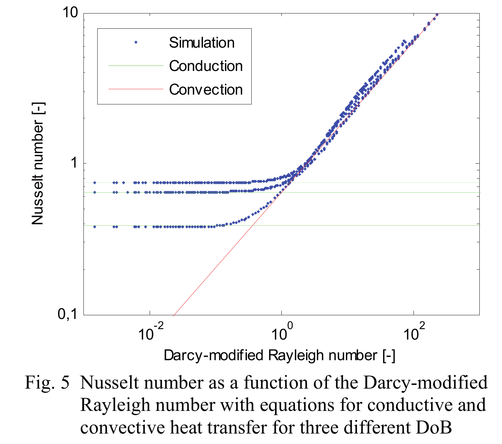

## Combined Conduction and Natural Convection Cooling of Offshore Power Cables in Porous Sea Soil
> T'Jollyn, I., Callewaert, M., Nonneman, J., Van de Wauw, J., Ameel, B., & De Pacpe, M. (2019, May). Combined Conduction and Natural Convection Cooling of Offshore Power Cables in Porous Sea Soil. In _2019 18th IEEE Intersociety Conference on Thermal and Thermomechanical Phenomena in Electronic Systems (ITherm)_ (pp. 1307-1312). IEEE.

[Paper](https://ieeexplore.ieee.org/stamp/stamp.jsp?arnumber=8757354)

> Keywords: #conduction-convection #numerical #nusselt-number #rayleigh-darcy

### Research questions
- What is the temperature at which cables can operate? Increase in power causes the cable to heat up:
> 90C.
- There exists regions of conduction and convection. Is there an intermediary region where both exists? What factors influence these response?
> Soil parameters (thermal conductivity, permeability). 

### Future research/unanswered questions
- Does depth of burial affect the transition point between conduction and convection?
- Is convection independent of depth of burial?
- Plot the temperature difference between the cable and the oil pipeline for different permeability to see the difference increase, as the permeability increases. 
- Compare Peclet number with Ra. Peclet for heat transfer is $Pe = Lu / \alpha$, $u$ flow velocity, $L$ characteristic length and $\alpha$ thermal diffusivity.

### Main findings
- Natural convection could reduce the heat transfer.
- Hardee, Merkin and Fand only show convection dominated flow.
- Hughes and Emeena showed both conduction and convection dominated flow
- Thermal resistance of the cable: R
   $$R = \frac{1}{2 \pi k_e} \ln\left(\frac{2 DoB}{D} + \sqrt{(\frac{2 DoB}{D})^2 -1}\right)$$
   $$R = \frac{1}{2 \pi k_e} \ln\left(\frac{4 DoB}{D}\right)$$ for large burial depths. $D$ diameter of pipe, $k_e$ thermal conductivity, and $DoB$ depth of burial.
- Hardee convective flow, gave the Nusselt number $Nu = 0.465 Ra^{\prime 0.5}$. $Nu = \frac{hD}{k_e} = \frac{qD}{\Delta T k_e}$, where $h$ convective heat transfer, $q$ heat flux.
- Merkin convective flow: $Nu = 0.565 Ra^{\prime 0.5}$
- Fand: $Nu = 0.654 Ra^{\prime 0.649}Pr^{0.124}$, $Pr$ is Prandtl number.

- Churchil and Usagi: $Nu_{cond} = \frac{2}{\ln (\frac{DoB}{D})} = \frac{1}{\pi k_e R}$
- Combined Nusselt number: $Nu = (Nu_{cond}^n + Nu_{conv}^n)^{1/n}$, where $n = 5$. 

