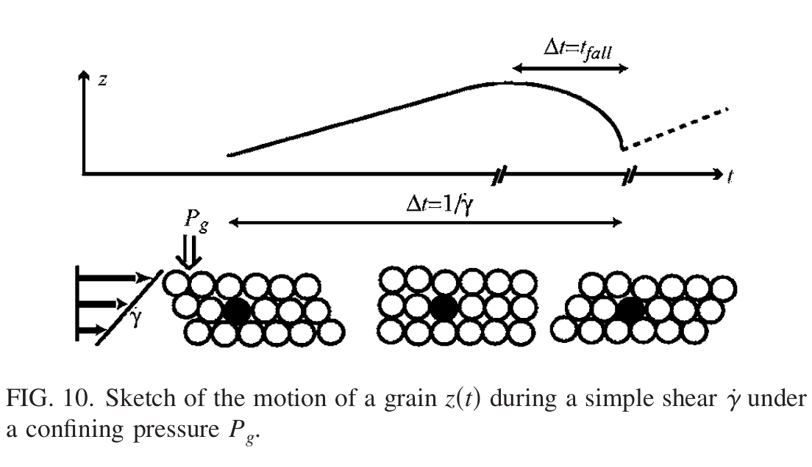
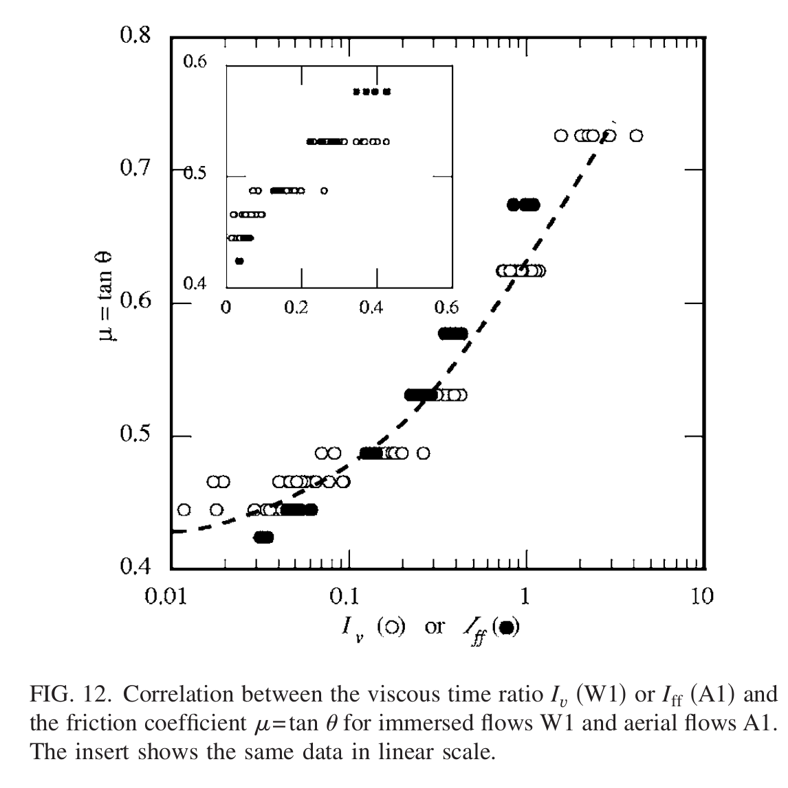

## Submarine granular flows down inclined planes
> Cassar, C., Nicolas, M., & Pouliquen, O. (2005). Submarine granular flows down inclined planes. _Physics of fluids_, _17_(10), 103301.

[Paper](https://aip.scitation.org/doi/full/10.1063/1.2069864)

> Keywords: #granular-flow-regimes #submarine #viscous-regime #inertial-regime #freefall-regime 

### Further reading
- Gravity Currents: In the Environment and the Laboratory: Describes how entrainment happens due to shear at the solid-fluid interface. 
- F. A. L. Dullien, Fluid Transport, and Pore Structure Academic, San
Diego, 1992 for determining $\alpha$ based on grain size distribution. 

### Research questions
- Does the submarine slide behave like a non-Newtonian material? If a Bingham type material is suitable for pure mudflow, it is certainly less justified when non-colloidal particles are involved in the flowing mixture. So why do we still use these models?
> Even in a simple case, the rheology of granular flow is non-trivial. The runout behavior of granular material is characterized by viscosity diverges when increasing the volume fraction and by the development of normal stresses. Hence, Bingham type non-Newtonian models cannot represent the granular flow behavior when the granular mass is dense.
- How does a submerged granular flow differ from a submerged case?
> The presence of interstitial fluid only influences the timescale of the flow behavior. However, this assumption ignores the tight coupling between the fluid and the solid yet is able to reproduce the majority of the behavior. 

- What are the timescales involved in the submerged granular flows?
> Three different scales: Free-fall, Viscous, and Inertial regime scales. 

## Future research / unresolved questions

- The experiments result in a uniform thickness of the flow, and no deposition or entrainment occurs. What would be the influence of volume changes and correspondingly the changes in the pore-pressure on the runout behavior?
- Subaqueous flows have a larger critical thickness below which no flow happens even with an increase in the slope angle. This behavior is not known, and existing rheological models are unable to describe this response. The existence of $h_{stop}$ is not predicted by theoretical descriptions in both immersed and dry conditions. 
- A constant value of $h_{stop}$ above a slope angle of 30* in submerged conditions may indicate some balancing force at the flow front? Could this be investigated using a wind-tunnel-like set-up to compute the drag force on different flow fronts? What is the origin of $h_{stop}$? Is $h_{stop}$ affected by the flow front?
- Submarine flow experiment in Cambridge using clayey soil has shown the flow front undergoing significant deformation and erosion. However, the authors show under constant thickness experiment, and this is not the case. What is the role of the front in water entrainment?
- How does flow thickness influence control the mean velocity, and does this depend on the grain scale? Potentially use $h/d$, where $h$ is the thickness to $d$ is the mean grain diameter, to investigate this effect.
- Estimate drag force coefficient $\alpha$, where $k = \alpha d^2$. A better estimate of $\alpha$ by studying the motion of one particle in the midst of others could better understand the drag forces. 
- Using a confined periodic shear experiment, determine $v_{\infty v}$ and $t_{av}$ in viscous regimes. 
- $I$ does not vary across layers and is independent of the depth $z$. However, this contrasts with changes in pore pressure $\Delta P$ with thickness, as this affects the confining pressure. The presence of water on the confining pressure is ignored and only accounts for the timescale in granular flow response. 
- How does the effect of change in excess pore pressure result from volume changes due to the shearing effect of the coupled fluid-solid response.
- Investigate transient regimes, where volume or thickness is not constant during the flow at small-scales, can provide useful insights when excess pore pressures could strongly modify the balance between stresses carried by the fluid and the stresses carried by the grains.

## Main findings
- When the granular material thickness dropped below a critical limit, the flow does not happen - $h_{stop}$. In submerged conditions, in spite of the increase in the slope angle above 30*, the $h_{stop}$ remained constant. 
- In this controlled thickness experiment, the flow front is observed to flow down the slope without any deformation. Behind the front, a steady uniform flow happens with a constant thickness, and the base pore water pressure remains constant. 
- In aerial flows, as the thickness is increased, the flow front velocity increased linearly, while the submerged case sowed a non-linear increase (velocity increased significantly more with thickness). However, the velocities were an order of magnitude smaller than the aerial conditions. In submerged case, the larger particles showed less of this non-linear effect, while smaller particles showed a non-linear relation between velocity and thickness. The effect cannot be because of hydroplaning, as no change in volume or water entrainment was observed. Furthermore, larger particles showed higher pore pressures and slightly higher velocities. The pore pressure values were in the order of 10 Pa, and the effect of larger particles showing higher pore pressure could be an effect of increased available potential energy and therefore exerting higher stresses on water.
- Constant thickness flow experiments showed positive excess pore pressures and no suction (no negative pore water pressures). 
- The pore pressure of a suspension is $\Delta P_{susp} = \Delta \rho g h \cos \theta$, where $\Delta \rho = \Phi (\rho_s - \rho_f)$. The ratio of the pore pressure measured in the constant thickness flow experiment and the suspension pressure is $\Delta P / \Delta P_{susp}\approx 0.25$, which means 75% of the weight of the particles is taken by contact interactions. 
- Pore pressure increases linearly with thickness. 
- Shear stress at the interface is $\eta \dot{\gamma} = 4E-3 Pa$, compared to a $\Delta P=12 Pa$. So the shear at the solid-fluid interface is assumed to be negligible. 

#### Dry granular flows
- For dry flows, the shear stress is written as $\tau = P_g \mu(I)$, where $P_g$ is the confining pressure on grains and $\dot\gamma$ is the shear rate. The friction coefficient depends on a single dimensionless parameter $I = \dot\gamma d / \sqrt{P_g/\rho_s}$, where $\rho_s$ is the solid density (GDR Midi).  
- The rearrangement time is the free-fall time for a particle to fall through a hole of a particle size: $t_{ff} = \frac{d}{\sqrt{P_g/\rho_s}}$.
- $I$ is interpreted as the ratio between the rapid time of rearrangement $t_{ff}$ and the mean time $t_{\dot\gamma} = 1/\dot\gamma$ spent by the particle to move from one hole to the next. 

- $I$ is the square root of Savage or Coulomb number, which is the ratio between collisional stress and total stress.

#### Immersed granular flows
- Immersed dense granular flows can be described by the same constitutive laws as the dry $\mu(I)$ rheology.
- The equation of motion in vertical direction of a particle subjected to a confining pressure $P_g$ in a fluid of density $\rho_f$ and viscosity $\eta_f$: $$\frac{\pi}{6} \rho_s d^3 \frac{dv}{dt} = \frac{\pi}{4}P_g d^2 - F_d$$.
- In dry granular flows, $F_d = 0$ there is no drag force. The time for particle to travel one grain diameter $d$ is written as: $t_{ff} = d \sqrt{2\rho_s/3P_g}$.
- **Viscous regime $(Re << 1)$**:  Fall of grain is hindered by viscous drag force and the displaced liquid has to flow through a porous medium of permeability $k = \alpha d^2$. Using Darcy's law, the pressure difference across particle is: $\eta_f dv_p/k$. The drag force is $F_d = \frac{\pi}{4} \alpha \eta_f dv_p$.
	- The estimation of $\alpha$ is not easy as it depends on the size distribution of particle. For a packing fraction $\Phi = 0.55$, $\alpha$ varies between $5E-3$ and $1E-2$, a value of $\alpha = 0.01$ is used. At short times, the grain first accelerates reaches a limit viscous velocity $v_{\infty v}$ in a characteristic acceleration time $t_{av}$. $$v_{\infty v} = P_g \alpha d / \eta_f \quad t_{av} = \frac{2 \rho_s \alpha d^2}{3 \eta_f}$$
	- If $t_{av} << t_{ff}$, the particle rapidly reaches its limit velocity. The time for a particle to travel a distance is then $t_{fall} = d/v_{\infty v}$, otherwise $t_{fall} = t_{ff}$. 
- **Inertial regime $(Re >> 1)$**: 
	- Drag force, where $C_d$ is the drag coefficient of 0.4 is assumed for $10^3 < Re < 10^5$. Grain reaches a limiting velocity $v_{\infty i}$ and $t_{ai}$: $$v_{\infty i} = \sqrt{\frac{3 P_g}{2\rho_f C_d}} \quad t_{ai} = \rho_s d \sqrt{2/3 \rho_f C_d P_g}$$
	- If $t_{ai} << t_{ff}$, the particle rapidly reaches its limiting velocity and time to travel a diameter is then given by $t_{fall} = d/v_{\infty i}$. 
- **Regimes**: Courrech du Pont [[granular-avalanches-fluid]] introduced Stokes number $St = t_{av} / t_{ff}$, density ratio $r = t_{ai}/t_{ff}$, and $Re = t_{av}/t_{ai}$. $$St = \sqrt{\frac{2}{3}}\frac{\alpha d \sqrt{\rho_s P_g}}{\eta_f}; \quad r = \sqrt{\frac{\rho_s}{\rho_f C_d}}; \quad Re = \frac{St}{r} = \frac{\alpha d}{\eta_f}\sqrt{\frac{2\rho_f C_d P_g}{3}}$$
- Constitutive relation:
	- Free fall regime $St >> 1$ and $r >> 1$: $$I = I_{ff} = \dot\gamma d \sqrt{\frac{2 \rho_s}{3P_g}}$$
	- Viscous regime $St << 1$ and $r >> St$: $$I = I_{v} = \frac{\dot\gamma \eta_f}{\alpha P_g}$$
	- Inertial regime $St >> r$ and $r << 1$: $$I = I_i = \dot\gamma d \sqrt{\frac{2\rho_f C_d}{3 P_g}}$$
- Strong assumption: Interstitial fluid only plays a role in changing the timescale of microscopic rearrangement, which leads to $\mu(I) = \tan \theta$ meaning $I$ does not vary across layers and is independent of the depth $z$. 

- $\mu(I)$ relation for submerged granular flow is valid if the assumption that the fluid only changes the timescale of the flow behavior is correct. Although inertial and viscous collapse around this behavior is not definite, the modified timescale can predict the main effects. 